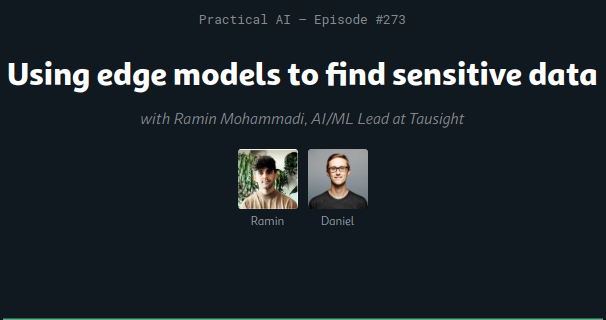

## Hi there 👋

Here are some ideas to get you started:

- 🔭 I’m currently working on some cool stuff and Tausight and also am develpoing Gen-AI (IE7374) and NLP (IE7500) courses.
- 🌱 I’m currently learning so manythings 🤣
- 👯 I’m looking to collaborate on [!MLOPS](https://github.com/raminmohammadi/MLOps) repo.
- 📫 How to reach me: R.mohammadi@northeastern.edu
- 👨‍💻  Read more about my projects at Tausight at 
- ⚡ Fun fact: Love ma 🐶 and 💪

✨  About Me

I’m an Adjunct Professor at Northeastern University in the College of Engineering, where my work revolves around the exciting fields of Machine Learning (ML), Natural Language Processing (NLP), and MLOps, particularly with a focus on their applications in healthcare.

My research primarily centers on the practical use of ML and NLP, with an emphasis on their real-world applications in healthcare and the essential area of healthcare cybersecurity.

In the healthcare domain, I deal with various methodological challenges. These include predicting diseases, making ML models more interpretable, tracking and detecting medical entities, and ensuring the trustworthiness of model outputs. 

Another exciting aspect of my research is dedicated to creating language technologies that can automate or semi-automate the detection and protection of Personal Health Identifiable (PHI) information. This work has led to some intriguing developments.

🎬 Videos
- IE 7300 - [Statistical Learning In Engineering](https://www.youtube.com/watch?v=n4O1YGm7gNI&list=PLcS4TrUUc53KRbf5iPBYRb5Vs8TmtVZOK)
- IE 7374 - [Machine Learning In Operation](https://www.youtube.com/watch?v=KOpbqgvT-10&list=PLcS4TrUUc53LeKBIyXAaERFKBJ3dvc9GZ) 

📕  Latest Blog Posts
 - [Edge Based AI Solution for Healthcare Organizations](https://www.tausight.com/tausight-edge-based-ai-solution-healthcare-organizations/)
 - [Unlocking Data Security: From Data Loss Prevention to AI Revolution](https://www.tausight.com/unlocking-data-security-data-loss-prevention-to-ai/)

### Practical AI 273: Using edge models to find sensitive data

Listen to the episode using the link below:

(https://changelog.com/practicalai/273)

[Practical AI 273: Using edge models to find sensitive data](https://changelog.com/practicalai/273)

Alternatively, you can play the audio directly:

<audio controls>
  <source src="https://cdn.changelog.com/uploads/practicalai/273/practical-ai-273.mp3" type="audio/mpeg">
  Your browser does not support the audio element.
</audio>
